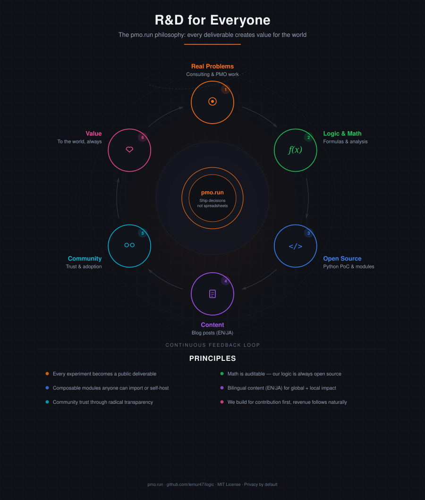

# pmo.run — Strategy

**Domain:** pmo.run
**Repo:** github.com/lemur47/logic
**Phase:** Awareness & Prototype → Agent PoC
**Last updated:** 2026-02-19

---

## Mission

Ship decisions, not spreadsheets.

Provide AI + human PMO services to SMEs, backed by open source decision-making tools that serve the global PM/PMO community. Every R&D deliverable creates value for the world — contribution first, revenue follows naturally.

## Philosophy: R&D for Everyone

Our flywheel runs on a simple principle: every experiment, every formula, every line of code we write becomes a public deliverable. We don't build in private and sell — we build in public and earn trust.



```
Real Problems (consulting & PMO work)
  → Logic & Math (formulas & analysis)
    → Open Source (Python PoC & modules)
      → Content (blog posts EN/JA)
        → Community (trust & adoption)
          → Value (to the world, always)
            → back to Real Problems
```

This is not a growth hack. It's the ethical foundation of the business.

## Principles

1. **Ship, don't perfect.** A live page beats a perfect plan.
2. **R&D = Content.** Every experiment becomes a blog post.
3. **Privacy by default.** No tracking, no analytics cookies, encrypted storage.
4. **Two audiences, one brand.** SME clients (JA) and PMO community (EN).
5. **AI + Human.** The service is the product. Tools are the proof.
6. **Open source trust.** The logic repo is the credibility engine.
7. **Composable over monolithic.** Small modules anyone can import, not a walled garden.
8. **Authenticity over marketing.** When math contradicts the pitch, fix the pitch.

---

## Two Audiences, Two Languages

| Attribute | Primary: SME Managers (JA) | Secondary: PM/PMO Community (EN) |
|-----------|---------------------------|----------------------------------|
| Who | CEOs, COOs, dept heads at 5-200 person companies | Dedicated PMO staff, project managers, developers |
| Relationship | Direct consulting clients | Tool users, community, word-of-mouth |
| Language | Japanese-first | English-first |
| What they need | Decisions answered ("Is this investment worth it?") | Tools to use ("TCO calculator with NPV") |
| How they find us | Blog (JA), referrals, LinkedIn JP | GitHub, blog (EN), dev.to, Hacker News |
| Revenue model | Consulting fees | API subscriptions (future) |

### Content Split

- **Japanese pages:** Business outcomes, real-world case studies, consulting CTA, plain language
- **English pages:** Technical tools, API docs, open source repo, PMO methodology

---

## Product Architecture

### Five-Layer Architecture

```
┌─────────────────────────────────────────────────────────┐
│  CLIENT LAYER                                           │
│  Astro + Svelte  |  E2EE via Web Crypto API  |  EN/JA  │
├─────────────────────────────────────────────────────────┤
│  AGENT LAYER                                            │
│  Cloudflare Agents SDK  |  Durable Objects  |           │
│  AI Gateway  |  Workflows (human-in-the-loop)           │
├─────────────────────────────────────────────────────────┤
│  LOGIC LAYER                                            │
│  TCO | PERT | Base-rate | Bayesian | NPV | IRR          │
│  Python (community) + TypeScript (product)              │
├─────────────────────────────────────────────────────────┤
│  DATA LAYER                                             │
│  D1 (plaintext metadata)  |  R2 (encrypted blobs)      │
│  Vectorize (future RAG)                                 │
├─────────────────────────────────────────────────────────┤
│  INTEGRATION LAYER                                      │
│  Baserow | External APIs | MCP Servers                  │
│  Browser Rendering                                      │
└─────────────────────────────────────────────────────────┘
```

### Dual Codebase Strategy

| Codebase | Language | Purpose | Audience |
|----------|----------|---------|----------|
| `logic` repo | Python | Open source PoCs, standalone modules, FastAPI prototypes | Community, developers, self-hosters |
| Cloudflare Agent | TypeScript | Production product, Agents SDK, Workers runtime | Paying customers, platform |

Same math, two runtimes. The Python-to-TypeScript port is itself a blog post series.

### Logic Modules

Every module follows: **Standalone PoC → FastAPI endpoint → Agent tool → Interactive UI**

| Module | Category | Status | Description |
|--------|----------|--------|-------------|
| TCO | Finance | ✅ Live | Total Cost of Ownership with NPV adjustment |
| PERT | P3M/P3G | 🔨 Next | Three-point estimation (optimistic/likely/pessimistic) |
| Base-rate | P3M/P3G | 📋 Planned | Reference class forecasting, reduce subjective bias |
| Bayesian | P3M/P3G | 📋 Planned | Bayesian updating for base-rate learning |
| NPV | Finance | 📋 Planned | Net Present Value analysis |
| IRR | Finance | 📋 Planned | Internal Rate of Return |

### Logic API

Every logic module is available as:

- **Python import:** `from logic.tco.core import calculate_tco` — for developers integrating into their own systems
- **FastAPI endpoint:** `POST /tco/calculate` — stateless HTTP API for any client
- **Agent tool:** Callable by the Cloudflare Agent for orchestrated decision workflows

The API is not a separate product — it's an inherent property of composable logic.

### TCO Endpoints (Live)

```
POST /tco/calculate       → Stateless TCO calculation
POST /tco/compare         → Compare options, ranked by annual cost
POST /tco/breakeven       → Break-even analysis between two options
POST /tco/scenarios       → Save scenario (CRUD)
GET  /tco/scenarios       → List scenarios (paginated, searchable)
GET  /tco/scenarios/stats → Aggregate statistics
```

---

## Agent Architecture

### Why an Agent, Not Just an API

A raw LLM gives essays. Our PMO Agent gives auditable decisions backed by deterministic math, governance workflows, and integration with the client's actual operational tools.

**Differentiation from generic AI:**

- **Domain-encoded logic.** PERT, TCO, Bayesian — precise calculations, not probabilistic text.
- **Human-in-the-loop as a feature.** Cloudflare Workflows `waitForApproval()` maps to real PMO governance: calculate → review → approve → execute.
- **External tool orchestration.** Agent writes to Baserow (WBS/timeline), reads from D1 (metadata), triggers reports — automation that LLMs alone can't do.

### Decision Flow Example

```
Client question
  → Agent reasons about intent (LLM via AI Gateway)
    → Calls TCO/PERT tools (our logic layer)
      → Stores results in D1 (structured metadata)
        → Pushes WBS/timeline to Baserow
          → Pauses for human review (Workflow)
            → On approval: generates report, updates status
              → Logs everything via AI Gateway (billing/analytics)
```

### AI Gateway: Billing, Analytics, and Process Mining

AI Gateway provides cost visibility and model-switching flexibility. Beyond billing:

- Every agent interaction is logged — which tools get called, how often, in what sequence.
- Over time, this becomes a **process mining dataset**: how SMEs actually make decisions.
- Anonymised, aggregated insights become blog content and consulting IP.
- 30-day Cloudflare analytics for operational view; archive to R2/D1 for long-term analysis.

---

## Privacy Architecture: E2EE

Inspired by Proton Mail's PGP model, adapted for PMO data.

### The Split: Plaintext Metadata + Encrypted Body

```
D1 (plaintext, queryable by agent):
  - project_id, client_id, created_at
  - document_type: "tco_scenario"
  - tags: ["build-vs-buy", "q3-2026"]
  - status: "pending_review"

R2 (encrypted blob, decrypted only in client browser):
  - Full TCO calculation results
  - Client's proprietary cost data
  - Decision rationale and notes
```

### Encryption Stack

- **Browser (Svelte):** AES-256-GCM via Web Crypto API. Key derived from user passphrase via PBKDF2. Key never leaves the browser.
- **Cloudflare Workers:** Web Crypto API natively supported. Can handle encrypted blob routing without decryption.
- **Python (logic repo):** Reference implementation for CLI tools and third-party integrations.

### Zero-Knowledge Guarantee

The agent queries D1 metadata to orchestrate workflows (schedule, approve, report) without ever accessing the encrypted body. We never see client data in plaintext. This is the enterprise security moat.

---

## Website: pmo.run

### Tech Stack

- **Framework:** Astro (static + islands)
- **Interactive components:** Svelte (lighter, aligns with Astro)
- **Styling:** Tailwind CSS
- **Hosting:** Cloudflare Pages
- **i18n:** Astro built-in (EN/JA)
- **API backend:** Cloudflare Workers (Agent) + FastAPI (Python community)

### Site Structure

```
pmo.run/
├── /[lang]/                → Landing page
│   ├── /en/                → "PMO tools + services powered by AI"
│   └── /ja/                → "AIとプロフェッショナルによるPMOサービス"
├── /[lang]/tools/
│   ├── /tools/tco          → Interactive TCO calculator
│   ├── /tools/pert         → PERT estimator (when ready)
│   └── /tools/breakeven    → Break-even analyzer
├── /[lang]/blog/           → R&D notes, case studies (bilingual)
├── /[lang]/docs/           → API documentation
└── /[lang]/contact/        → Consulting inquiry form
```

### Design Principles

- Nerdy but simple — no corporate fluff
- Tools work without signup
- Privacy-first — no tracking, no analytics cookies
- Fast — static pages, edge-deployed
- Real examples — every tool page has a business case story

---

## Monetisation Strategy

### Phase 1: Consulting + Free Tools + PoC Spike (Now → Q2 2026)

Revenue comes from consulting. Tools and content are free. The website and repo are the storefront.

**Service model:** AI + human working together to analyse, calculate, advise, prototype, and deliver.

**Key deliverables this phase:**
- PERT module (standalone → FastAPI → interactive page)
- Cloudflare Agent PoC spike (TCO as tool + Workflow approval gate)
- 5+ blog posts (bilingual, from R&D and consulting experience)
- First direct consulting clients (JA market)

**Pricing:** Project-based or retainer. Japanese SME market first.

### Phase 2: PMO Agent MVP + Freemium SaaS (Q3-Q4 2026)

Free tools remain free. Agent goes live. Paid tier adds:
- Saved scenarios and PDF report export
- Team sharing with role-based access
- Encrypted storage (E2EE)
- Baserow integration for WBS/timeline management
- AI Gateway billing and analytics dashboard
- API rate increases

### Phase 3: Platform + E2EE + Ecosystem (2027)

- Full E2EE implementation (Web Crypto API, Proton pattern)
- Vectorize for RAG over PMO knowledge base
- MCP servers for third-party integrations
- AI PMO Assistant (natural language queries over project data)
- Enterprise custom plans (private cloud storage option)
- Process mining dashboard (anonymised decision analytics)

---

## Technical Decisions

| Decision | Resolution | Notes |
|----------|-----------|-------|
| API hosting | Cloudflare Workers (Agent) | Agent architecture supersedes VPS option |
| Interactive components | Svelte | Lighter, aligns with Astro islands |
| i18n approach | Astro content collections | Scales better for bilingual content |
| Auth (Phase 2) | Cloudflare Access | Integrates with Agent/Workers stack |
| Storage | D1 (metadata) + R2 (encrypted blobs) | Proton pattern: plaintext index + encrypted body |
| Encryption | AES-256-GCM via Web Crypto API | Same API in browser, Workers, and Node.js |
| Python vs TypeScript | Both | Python for community, TypeScript for product |

---

## Content Flywheel

Every R&D experiment and consulting engagement produces content:

```
R&D / Consulting / Real PMO Problems
      ↓
PoC Script (committed to logic repo, MIT)
      ↓
Blog Post (EN + JA) explaining the problem, math, and solution
      ↓
Tool Page on pmo.run (interactive Svelte component)
      ↓
Social sharing (LinkedIn JP, dev.to EN, Hacker News)
      ↓
Traffic → Consulting inquiries + API/tool users
      ↓
More real problems → More content → More trust
```

### Blog Post Pipeline

| # | Title (EN) | Title (JA) | Ties to |
|---|-----------|-----------|---------|
| 1 | "Cheap vs Inexpensive: TCO for office equipment" | 「安い」と「お得」は違う：オフィス機器のTCO分析 | TCO tool |
| 2 | "Build vs Buy: A framework with real numbers" | 内製 vs 外注：数字で考えるフレームワーク | TCO breakeven |
| 3 | "Why your project estimates are always wrong" | なぜプロジェクトの見積もりはいつも外れるのか | PERT tool |
| 4 | "Why your project docs rot — and a system-level fix" | なぜプロジェクトのドキュメントは腐るのか | DevSecOps insight |
| 5 | "Reference class forecasting for SMEs" | 中小企業のための参照クラス予測 | Base-rate tool |
| 6 | "The time value of money, explained with Python" | Pythonで理解するお金の時間的価値 | NPV module |
| 7 | "Privacy-first project data: E2EE with Web Crypto API" | プライバシー優先のプロジェクトデータ管理 | Encryption PoC |
| 8 | "PMO tools on Cloudflare Agents: a PoC" | Cloudflare Agentsで動くPMOツール | Agent architecture |
| 9 | "Connecting Baserow to automated cost analysis" | Baserowで自動コスト分析を構築する | Integration PoC |
| 10 | "How AI + human PMO services actually work" | AI×人間のPMOサービスとは何か | Service marketing |
| 11 | "Open source tools for PMO: why we build in public" | なぜ私たちはオープンソースでPMOツールを作るのか | Brand story |
| 12 | "Cloud migration TCO: numbers your vendor won't show" | クラウド移行のTCO：ベンダーが見せない数字 | TCO tool |

---

## Real-World Problem: DevSecOps in PMO

From direct consulting experience — the pattern every enterprise PMO team suffers:

**Symptoms:**
- Notion/Confluence/Wiki manually edited and slowly rotting
- ClickUp/Jira tickets non-maintained, disconnected from reality
- GitLab/GitHub Issues used as a poor backlog with no estimation discipline
- WBS in spreadsheets: estimation-result gaps never tracked or learned from

**Our solution stack maps directly:**

| Pain | Our Module | Level |
|------|-----------|-------|
| Estimation gaps | PERT (three-point estimation) | Logic |
| No learning from past estimates | Bayesian updating | Logic |
| Manual WBS management | Baserow integration (timeline, status) | Integration |
| Disconnected tooling | Agent orchestration (Workflows) | Agent |
| No decision analytics | AI Gateway + process mining | Analytics |
| Data security concerns | E2EE (Proton pattern) | Privacy |
| Documentation decay | Our own repo as the example | Meta |

**Key insight:** We don't just build tools for this problem — we live it, document it, and solve it in public. The logic repo's own documentation, issue management, and CI/CD pipeline is the proof that the system works.

---

## Strategic Positioning

### Appeal to Cloudflare

First PMO-domain Agent on their platform. Showcases: Agents SDK, Workflows, AI Gateway, D1, R2, E2EE, Browser Rendering. Target: Developer Blog co-authorship and "Powered by Cloudflare" showcase.

### Appeal to Anthropic

CLAUDE.md-driven development workflow. PMO prompt library on GitHub. Domain-specific Claude integration for business decision-making. Target: best-practice showcase for "how Claude powers enterprise decisions."

### Competitive Moat

- **Domain logic:** PMO-specific math no generic AI provides
- **Human-in-the-loop:** Governance workflows, not just chat
- **E2EE by default:** Zero-knowledge, enterprise-ready
- **Dual language:** JA consulting + EN community
- **Open source trust:** Credibility via radical transparency
- **Composable modules:** Partial adoption lowers barrier, builds embedded presence

---

## IP Strategy: Open Core + Proprietary Plugins

### Principle

Logic and code are public. Data and calibration models are protected. The math stays open — what stays proprietary is the *reasoning that tells the math which variables matter*.

### Three-Layer IP Architecture

```
┌─────────────────────────────────────────────────────────┐
│  OSS LAYER (trust + adoption)                           │
│  MIT licensed. Pure math: PERT, TCO, NPV, Bayesian.     │
│  FastAPI endpoints, CLI tools, Python imports.           │
│  Anyone can use, audit, fork, self-host.                │
├─────────────────────────────────────────────────────────┤
│  PRODUCT LAYER (platform + workflows)                   │
│  Agent orchestration, E2EE, Baserow integration.        │
│  Cloudflare Workers, Workflows, AI Gateway.             │
│  Freemium → paid SaaS.                                  │
├─────────────────────────────────────────────────────────┤
│  PROPRIETARY PLUGIN LAYER (IP + exit value)             │
│  Field-calibrated adjustment coefficients.              │
│  Risk pattern recognition models.                       │
│  Observation frameworks ("what to measure").             │
│  Industry-specific delay/risk profiles.                 │
│  Client's own data (E2EE protected, never visible).     │
└─────────────────────────────────────────────────────────┘
```

### What We Sell Is Not Calculations

We deliver **cognition as code** — mental models and mindset encoded as executable logic:

1. **Evaluation frameworks** — "what to observe to find the problem's root cause." The structure of attention, not the data itself.
2. **Risk detection models** — systems-thinking-based inference that converts observation patterns into probability. Turns ignored gut feeling into "system says 82% chance of resource failure in 3 weeks."
3. **Calibration plugins** — field-tested adjustments that make standard mathematical models match reality. PERT says duration X; the plugin knows this approval process adds 3 days, this review phase has a 20% rejection rate.

### Plugin Architecture

Each logic module exposes a `PluginInterface` that accepts calibration data:

```
core.py          → Pure math (OSS, MIT)
calibration.py   → Plugin interface for field adjustments (OSS, MIT)
plugins/         → Proprietary calibration data and models (closed, B2B licensed)
```

A consulting firm buys access to the plugin layer, loads their own 10 years of project data, and gets a proprietary "AI-powered PMO engine" that only they have — built on our auditable open foundation.

### Why This Architecture Maximises Exit Value

- **Clear asset separation:** OSS continues as community trust engine. Proprietary plugins are the acquisition target with defined IP boundaries.
- **Buyer appeal:** Consulting firms want to turn veteran PMO knowledge ("tacit knowledge") into organisational assets. Our plugin framework is the container for that transformation.
- **Low acquirer dependency:** The plugin-creation process is documented (CLAUDE.md, development logs, this strategy). A buyer isn't locked into retaining the founder long-term.
- **E2EE protects everyone:** The buyer's client data stays encrypted. Our open code proves no backdoors. Trust architecture itself is IP.

### What Stays Open vs. Closed

| Layer | License | Rationale |
|-------|---------|-----------|
| Mathematical formulas (PERT, TCO, NPV, etc.) | MIT | Trust engine, community adoption, auditability |
| FastAPI endpoints, CLI tools, schemas | MIT | Adoption surface, composability proof |
| Plugin interface definitions | MIT | Enables ecosystem, lowers integration barrier |
| Agent orchestration (Cloudflare Workers) | Source-available or MIT | Platform showcase, transparency |
| Calibration coefficients and field models | Proprietary (B2B) | Core consulting IP, exit value |
| Risk pattern recognition models | Proprietary (B2B) | Systems thinking encoded, highest-value asset |
| Client data | E2EE, zero-knowledge | Never accessible, even by us |

---

## Go-to-Market: Sprint Plan

### March 2026: Distil & Ship (before SIer engagement ends March 31)

- [ ] Distil all DevSecOps insights from current project into blog drafts
- [ ] PERT module: standalone PoC → FastAPI endpoint
- [ ] Blog post #1: TCO case study (publish)
- [ ] Blog post #4 draft: "Why your project docs rot" (from live experience)
- [ ] Update CLAUDE.md with agent architecture context

### April 2026: Agent PoC Spike

- [ ] Cloudflare Agent PoC: 1 Agent + 1 Workflow + TCO as tool + waitForApproval
- [ ] Blog post about the PoC spike (EN — targets Cloudflare/developer audience)
- [ ] PERT interactive page on pmo.run
- [ ] Blog posts #2 and #3 (publish)
- [ ] LinkedIn posts begin (1-2/week, value-first)

### May-June 2026: Content Engine + Consulting Outreach

- [ ] Agent PoC validated → begin TypeScript port of TCO module
- [ ] Blog posts #5-#7 (publish)
- [ ] Submit to Hacker News (Show HN: Open source PMO decision tools)
- [ ] dev.to cross-post (EN)
- [ ] First consulting outreach from content base (JA, warm contacts)
- [ ] Begin encryption PoC (Web Crypto API in Svelte)
- [ ] Evaluate: demand signals for Phase 2?

### Q3-Q4 2026: Agent MVP

- [ ] TypeScript logic modules on Cloudflare Workers
- [ ] Agent with D1 metadata + R2 encrypted storage
- [ ] Baserow integration prototype
- [ ] AI Gateway billing dashboard
- [ ] Freemium tier launch

---

## Development Environment

- **OS:** Pop!_OS
- **Package management:** uv
- **Editor:** Zed
- **Python:** 3.14+ (FastAPI, SQLAlchemy, pytest)
- **TypeScript:** Cloudflare Workers, Agents SDK (future)
- **Frontend:** Astro + Svelte + Tailwind CSS
- **AI:** Claude (development partner, CLAUDE.md-driven)
- **Security:** gitleaks, bandit, ruff, pyright, pre-commit hooks, GitHub Actions CI

---

*This document is our public commitment and the context for Claude Code. Every decision here is traceable to a real problem, a mathematical model, or a consulting insight. We update it as we learn.*
