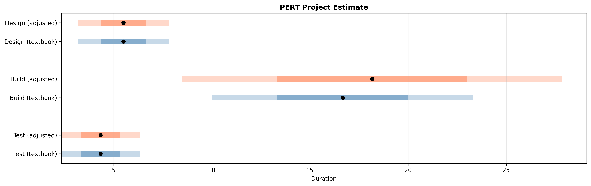

# PERT Estimator

**Reality-adjusted project estimation in pure Python.**

Because "about two weeks" is not a number.

## The Problem

"This task? Should take about two weeks."

Three months later, the project is still in progress. The team isn't slow — the estimate was wrong. Not because anyone lied, but because textbook PERT assumes a clean room that doesn't exist.

Real projects have:
- **Fragmented communication** — Slack threads, email chains, meetings about meetings
- **Multiple stakeholders** — each with different priorities, approval chains, and definitions of "done"
- **Hidden dependencies** — the API you need isn't documented, the upstream team is on vacation, the legacy system has undocumented quirks

This module adds "insight tags" — composable multipliers on the pessimistic estimate that encode these realities. The gap between textbook and adjusted estimates is where consulting experience lives.



## Quick Start

```python
from pert import estimate_task, FRAGMENTED_COMMUNICATION, MULTIPLE_STAKEHOLDERS

# Textbook PERT
result = estimate_task(5, 10, 20)
print(f"Expected: {result['textbook']['expected']} days")
# Expected: 10.83 days

# With reality adjustments
result = estimate_task(5, 10, 20, tags=[
    (FRAGMENTED_COMMUNICATION, 0.8),
    (MULTIPLE_STAKEHOLDERS, 0.6),
])
print(f"Adjusted: {result['adjusted']['expected']} days")
# Adjusted: 13.97 days
# That's +29% over textbook. Sound familiar?
```

## API

### `estimate_task()` — Single Task PERT

```python
from pert import estimate_task

result = estimate_task(
    optimistic=5,        # Best case (days)
    most_likely=10,      # Most probable (days)
    pessimistic=20,      # Worst case (days)
    tags=None,           # Optional reality adjustments
)

# Returns:
# {
#     "input": {"optimistic": 5, "most_likely": 10, "pessimistic": 20},
#     "textbook": {
#         "expected": 10.83,
#         "std_dev": 2.5,
#         "variance": 6.25,
#         "range_68": [8.33, 13.33],
#         "range_95": [5.83, 15.83],
#         "range_99": [3.33, 18.33],
#     },
#     "adjusted": None,  # or adjusted stats when tags are applied
# }
```

**Dependencies:** None

### `estimate_project()` — Multi-Task Aggregation

```python
from pert import estimate_project, FRAGMENTED_COMMUNICATION

project = estimate_project([
    {"name": "Design", "optimistic": 3, "most_likely": 5, "pessimistic": 10},
    {"name": "Build", "optimistic": 10, "most_likely": 15, "pessimistic": 30,
     "tags": [FRAGMENTED_COMMUNICATION]},
    {"name": "Test", "optimistic": 2, "most_likely": 4, "pessimistic": 8},
])

print(f"Textbook total: {project['project']['expected']} days")
print(f"Adjusted total: {project['adjusted_project']['expected']} days")
```

Aggregation uses standard PERT: project expected = sum of task expected values, project variance = sum of task variances.

**Dependencies:** None

### `visualize_estimate()` — Range Chart

```python
from pert import visualize_estimate

fig = visualize_estimate(result, save_path="estimate.png")
```

Horizontal range chart with confidence bands. Shows textbook vs adjusted side by side when tags are applied.

**Dependencies:** `matplotlib`

### Insight Tags — The Secret Sauce

Tags are composable multipliers on the pessimistic estimate:

```python
from pert import InsightTag, estimate_task

# Use a predefined tag at default severity (0.5)
result = estimate_task(5, 10, 20, tags=[FRAGMENTED_COMMUNICATION])

# Custom severity (0.0 = mild, 1.0 = severe)
result = estimate_task(5, 10, 20, tags=[
    (FRAGMENTED_COMMUNICATION, 0.8),
    (MULTIPLE_STAKEHOLDERS, 0.6),
])

# Create your own tag
TECH_DEBT = InsightTag("TECH_DEBT", "Legacy code drag", 1.1, 1.4)
result = estimate_task(5, 10, 20, tags=[TECH_DEBT])
```

**Predefined tags:**

| Tag | Min | Max | Default (0.5) | Why |
|-----|-----|-----|---------------|-----|
| `FRAGMENTED_COMMUNICATION` | 1.1x | 1.5x | 1.3x | Chat/meetings/manual workflows |
| `MULTIPLE_STAKEHOLDERS` | 1.15x | 2.0x | 1.575x | Misaligned interests across orgs |
| `HIDDEN_DEPENDENCIES` | 1.1x | 1.5x | 1.3x | Undocumented blockers |

Tags widen the pessimistic tail — they don't shift the optimistic or most likely estimates. Multiple tags multiply together: two 1.3x tags give 1.69x.

## Real-World Applications

### Sprint Planning

```python
sprint_tasks = [
    {"name": "Auth refactor", "optimistic": 2, "most_likely": 3, "pessimistic": 5,
     "tags": [(HIDDEN_DEPENDENCIES, 0.7)]},
    {"name": "Dashboard UI", "optimistic": 3, "most_likely": 5, "pessimistic": 8},
    {"name": "API integration", "optimistic": 1, "most_likely": 2, "pessimistic": 5,
     "tags": [(FRAGMENTED_COMMUNICATION, 0.6), (MULTIPLE_STAKEHOLDERS, 0.4)]},
]

project = estimate_project(sprint_tasks)
# Now you have a defensible range instead of a single-point guess
```

### Vendor Proposal Review

When a vendor says "6–8 weeks", ask yourself:

```python
# Their estimate
vendor = estimate_task(6, 7, 8)
# Expected: 7.0 weeks, 95% range: [6.33, 7.67]

# Your reality check
adjusted = estimate_task(6, 7, 8, tags=[
    (FRAGMENTED_COMMUNICATION, 0.7),
    (MULTIPLE_STAKEHOLDERS, 0.8),
    (HIDDEN_DEPENDENCIES, 0.5),
])
# The adjusted 95% range tells a very different story
```

### Comparing Approaches

```python
# Approach A: Quick and dirty
quick = estimate_task(5, 8, 15)

# Approach B: Proper architecture (more upfront, less risk)
proper = estimate_task(10, 14, 18)

# Approach A has a wider tail — the 95% range says it all
```

## The Mental Model

### Why Estimates Fail

PERT's textbook formula — `(O + 4M + P) / 6` — is solid math on a flawed assumption: that your pessimistic estimate actually captures the worst case.

In practice, "worst case" estimates suffer from:

1. **Anchoring** — You anchor to the most likely case and add a buffer. The buffer is almost always too small.
2. **Invisible correlations** — When communication is fragmented, *every* task slows down, not just one. Textbook PERT treats tasks as independent.
3. **Unknown unknowns** — Your pessimistic estimate only covers risks you can imagine. Insight tags encode the *categories* of risk you've seen before, even when specific risks are unknown.

Insight tags don't fix estimation — they make the uncertainty honest.

### Independence Assumption

Standard PERT aggregation sums variances across tasks, which assumes task durations are independent. In reality, insight tags like `FRAGMENTED_COMMUNICATION` and `MULTIPLE_STAKEHOLDERS` create correlated delays — when communication breaks down, it affects every task, not just one.

This means the aggregated variance may *underestimate* true project variance even with tags applied. Modelling covariance between tasks is a future enhancement. For now, treat adjusted project ranges as a lower bound on uncertainty.

## Dependencies

| Function | Requires |
|----------|----------|
| `estimate_task()` | Nothing |
| `estimate_project()` | Nothing |
| `visualize_estimate()` | matplotlib |

## Testing

```bash
# Run built-in examples
python pert.py

# Run test suite
pytest test_pert.py -v
```

## License

MIT — Use it however you want.

---

**Philosophy:** Make uncertainty visible, then manage it.

*"Plans are useless, but planning is indispensable."* — Dwight D. Eisenhower
